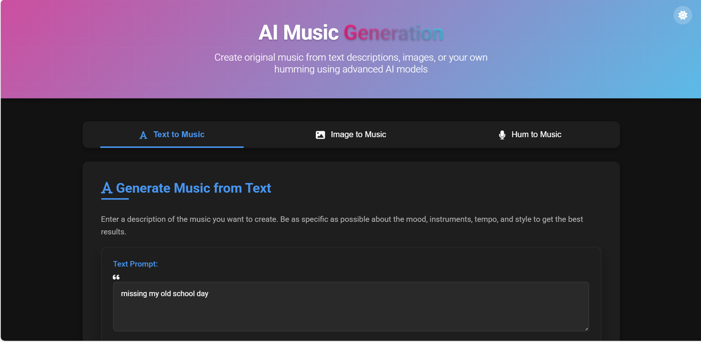
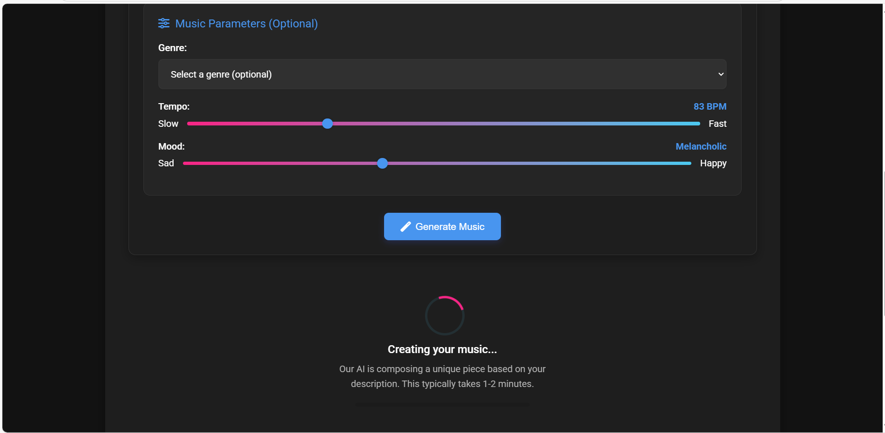
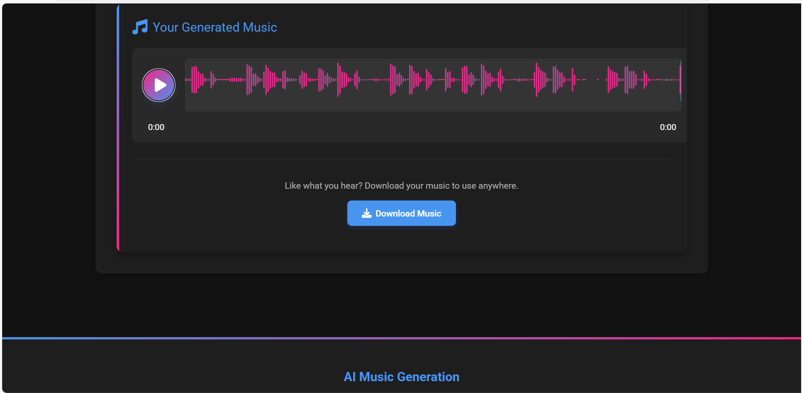
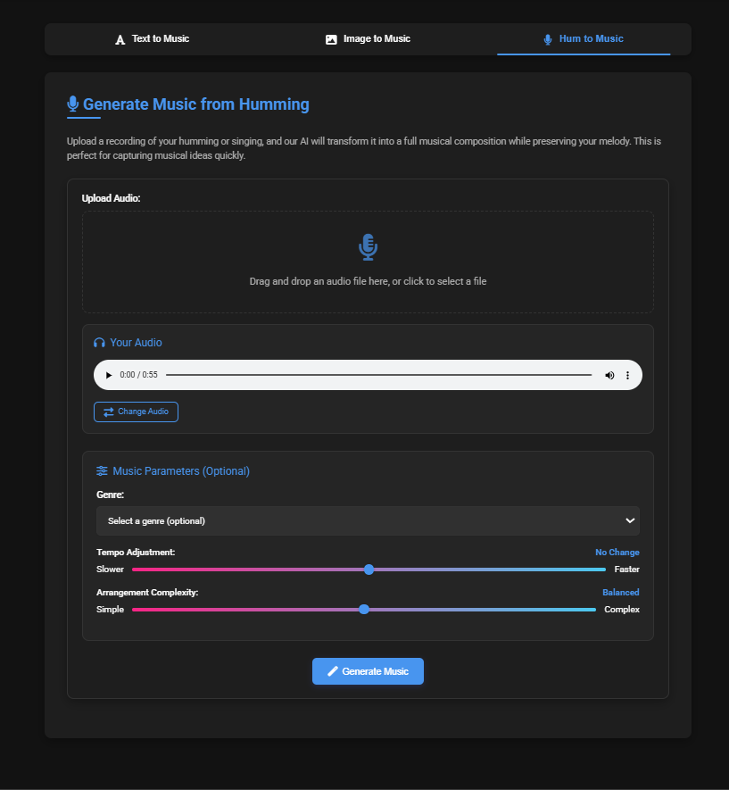
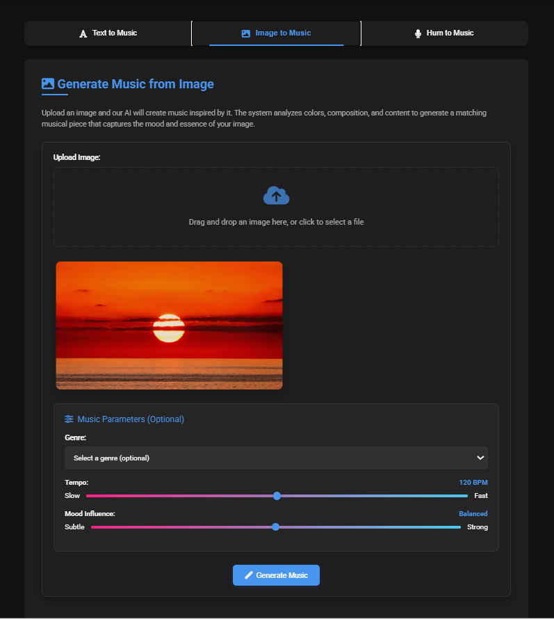

# Harmony AI: Multimodal Music Generation Web App...

A full-stack web application that generates original music compositions based on multimodal inputs: text descriptions, images, or humming/audio.



## Features

- **Text-to-Music**: Generate music from textual descriptions (e.g., "upbeat jazz" or "calm piano at sunset")
- **Image-to-Music**: Upload images and generate music inspired by their content and mood
- **Hum-to-Music**: Upload recordings of humming or singing to create full musical compositions
- **Customization**: Adjust parameters like genre, tempo, and mood to fine-tune the generated music
- **Download**: Save generated tracks as audio files

## Screenshots

### Text to Music


### Music Player


### Audio to Music


### Image to Music


## Technology Stack

### Backend
- Flask web framework
- PyTorch for deep learning
- Transformers library for text processing
- CLIP for image understanding
- Librosa for audio processing
- AudioCraft/MusicGen for music generation

### Frontend
- HTML/CSS/JavaScript
- Bootstrap for styling
- WaveSurfer.js for audio visualization

## Installation

1. Clone the repository:
```bash
git clone https://github.com/mydemon21/ai_music_generation_app.git
cd ai_music_generation_app
```

2. Create a virtual environment and activate it:
```bash
python -m venv venv
source venv/bin/activate  # On Windows: venv\Scripts\activate
```

3. Install the required packages:
```bash
pip install -r requirements.txt
```

4. Run the application:
```bash
python app.py
```

5. Open your browser and navigate to `http://127.0.0.1:5000`

## Usage

### Text to Music
1. Enter a descriptive text prompt about the music you want to generate
2. Adjust optional parameters like genre, tempo, and mood
3. Click "Generate Music"
4. Listen to the preview and download if desired

### Image to Music
1. Upload an image or drag and drop it into the designated area
2. Adjust optional parameters
3. Click "Generate Music"
4. Listen to the preview and download if desired

### Hum to Music
1. Upload an audio recording of your humming or singing
2. Adjust optional parameters
3. Click "Generate Music"
4. Listen to the preview and download if desired

## Project Structure

```
music_generation_app/
├── app.py                  # Main Flask application
├── requirements.txt        # Python dependencies
├── models/                 # Model implementations
├── static/                 # Static files (CSS, JS, etc.)
│   ├── css/
│   ├── js/
│   ├── uploads/            # Temporary storage for uploaded files
│   └── generated/          # Storage for generated music files
└── templates/              # HTML templates
```

## Future Improvements

- User accounts for saving generated music
- More fine-grained control over music generation parameters
- Additional music styles and genres
- Batch processing for generating multiple variations
- API access for integration with other applications

## License

This project is licensed under the [MIT License](LICENSE) - see the [LICENSE](LICENSE) file for details.

## Acknowledgments

- [AudioCraft](https://github.com/facebookresearch/audiocraft) by Meta Research
- [CLIP](https://github.com/openai/CLIP) by OpenAI
- [Librosa](https://librosa.org/) for audio processing
- [WaveSurfer.js](https://wavesurfer-js.org/) for audio visualization
